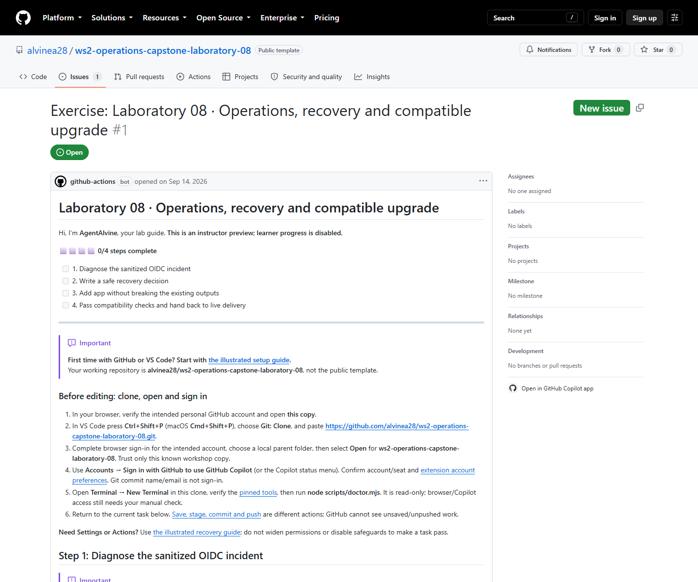

# Lab 08 · Full workshop content for review

[Repository landing](../README.md) · [Complete setup](00-start-here.md) · [Azure inputs and login](azure-setup.md) · [Simulation and verification](simulation.md)

> [!IMPORTANT]
> **Azure setup:** [enter your own tenant, subscription and existing RG](azure-setup.md#1-find-the-three-values-before-opening-the-terminal) · [Azure CLI login and current RG check](azure-setup.md#4-reuse-an-existing-login-or-sign-in-when-required). This complete guide covers read-only account/RG preparation, not provisioning authorization or new live evidence. Local quality checks and PR jobs remain credential-free.

This pack exposes the complete setup and every activity in [the course manifest](../.github/agentalvine/course.json). It is a **static review copy**, not another exercise, bug-ticket list, or learner progress tracker. Lesson text is bounded by preservation markers; only Markdown relative links outside code fences are rebased. Commands, examples, and publisher attribution remain the lesson's own content.

## Learner route: one copy, one Exercise issue

1. Use the [complete setup guide](00-start-here.md) to create **one private copy**, clone its own URL, open that clone, and check tools and accounts. If the copy already exists, do not copy again. No earlier repository is required.
2. Open the **Exercise** link in **your private copy's README**. This is the live issue to follow, not the source preview below.
3. Read the current activity. Make the real edits, save, commit, push, and inspect actual Actions checks. Follow real PR/review requirements wherever applicable; optional later release review is not an offline completion prerequisite.
4. **AgentAlvine validates those actual events and updates the SAME issue body**, including progress, feedback, and the next activity. Refresh that issue rather than making a ticket for each activity.
5. Actions implements AgentAlvine and the checks; it is **not a replacement for the issue-based learner experience**. This course completes offline after its current learner CI and handover gate, without requiring a merge or Lab 07 deployment.

Editing checkboxes never awards work and never authorizes Azure. Do not create evidence PRs, submit run IDs, or fabricate a reviewed release, approval, or live run. The [catalogue](https://github.com/alvinea28/ws2-workshop-catalogue) is only a directory of independent laboratories.

**Recovery only if the Exercise is missing:** first inspect startup and [troubleshooting](../docs/troubleshooting.md#agentalvine-or-the-exercise-is-missing). In the actual private copy, use **Actions → AgentAlvine → Run workflow → Check progress**, selecting that copy's **actual default branch** (normally `dev`). Then open the issue from its README. Do **not** choose **Preview** for a learner, invent an issue, or widen permissions. An existing issue with pending work needs its real prerequisites, not a forced recovery run.

## Complete activity sequence and original A/B status

Both original cycles were run on **2026-09-08**. “Verified” refers to the corresponding original private Exercise checkpoint, not completion in a new learner copy or the public source.

| Activity | Complete lesson | Cycle A | Cycle B |
| --- | --- | --- | --- |
| Setup | [Full first-time setup](00-start-here.md) | Guidance; not a progress checkpoint | Guidance; not a progress checkpoint |
| 01 | [Diagnose the sanitized OIDC incident](activity-01.md) | Verified offline | Verified offline |
| 02 | [Write a safe recovery decision](activity-02.md) | Verified offline | Verified offline |
| 03 | [Add app without breaking the existing outputs](activity-03.md) | Verified offline | Verified offline |
| 04 | [Pass compatibility checks and hand back to live delivery](activity-04.md) | Verified — offline complete | Verified — offline complete |

**Original progress: A 4/4; B 4/4.** Optional later genuine reviewed `v1.1.0` release, exact pin, and live Lab 07 `deploy` → `followup` → `destroy` remain **pending**, not required to complete Lab 08. This copy never becomes a second state writer. See [simulation.md](simulation.md) for whole-lab counts and evidence limits.

## Live public source preview — read-only, not learner progress

Open [public source Exercise #1](https://github.com/alvinea28/ws2-operations-capstone-laboratory-08/issues/1) to review the real instructor **Preview**. The **2026-09-14 read-only GitHub observation** confirmed a successful Preview workflow and **step 0, with 0/4 participant progress**. That source issue never becomes a learner's progress record; after copying, follow the Exercise link in your own README.

*Captured on 2026-09-14 from the actual public GitHub Exercise #1: read-only instructor Preview, step 0 (0/4). [images/provenance.json](images/provenance.json) records the PNG SHA-256 and exact capture timestamp. This current source Preview is not a September 8 participant screenshot or either private 4/4 outcome.*

See the separate [fresh local verification results](simulation.md#fresh-2026-09-14-verified-results) for command-output evidence, not participant progress.

Original private simulation records, immutable revisions, and actual Actions evidence are linked through the [private Lab 08 review](https://github.com/alvine-aurelio-org/ws2-public-rebuild-20260908-evidence/blob/dev/full-ws-content/lab-08/README.md). Screenshots supplement those records; they do not replace them.
