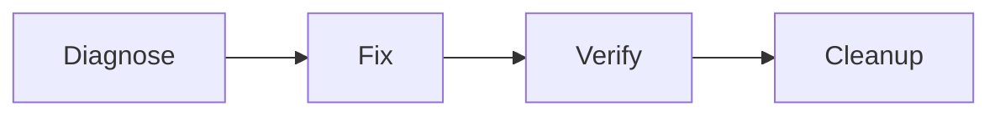

# Lab 08 · Activity 01 — Diagnose the sanitized OIDC incident

[Review index](README.md) · [Setup](00-start-here.md) · [Next activity](activity-02.md) · [Simulation evidence](simulation.md)

> [!NOTE]
> **Review copy, not a second progress tracker.** The complete canonical lesson follows. Learners follow the live **Exercise issue in their own private copy**, opened from that copy's README; AgentAlvine updates the same issue body. The public source preview awards no learner progress. Lab 08 completes offline; optional later release/live work is a separate outcome.

<!-- FULL-WS-LESSON:START -->
# Lab 08 · Step 1 — Diagnose the sanitized OIDC incident

**Goal:** Explain why an exact-subject authentication failure is not an RBAC failure.

| Working context | Selection |
| --- | --- |
| Branch | Actual default, normally `dev` → `lab/capstone` |
| Read | [incidents/oidc-subject.md](../incidents/oidc-subject.md) |
| Edit | [incidents/selected.json](../incidents/selected.json) only |
| Tools | Node **24.16.0**, Terraform **1.16.1**, AzureRM **5.4.0**; offline mocks |

**Independent entry:** Complete v1.0.0 module, example and incident are supplied. All four checkpoints work without another lab, Azure account, release or deployment. Public templates remain inert; Lab 08 never becomes a state writer.



Plain text: diagnose the fixture → fix the offline candidate → verify mocks/CI → document cleanup handover. Actual cleanup belongs only to an optional approved live cycle in the same Lab 07 writer.

## Do

### 1. Open your private copy once

Already in your copy's Exercise? **Do not copy again.** Otherwise install Git and desktop VS Code via [toolchain](../docs/toolchain.md); sign up/sign in to GitHub, verify email and accept any invitation. From the [Lab 08 source](https://github.com/alvinea28/ws2-operations-capstone-laboratory-08), choose **COPY EXERCISE**: intended Owner, unique name ending `laboratory-08`, **Private**, **Include all branches** off.

Copy **your copy's Code → HTTPS URL**, not the source URL. In desktop VS Code: **Ctrl+Shift+P → Git: Clone**, paste it, authorize the correct account in the trusted browser, choose a parent folder, then **Open** the clone. Trust only this repository; Explorer must show this clone, not a multi-lab parent or ZIP. On macOS use **Cmd**.


*REFERENCE — Microsoft, CC BY 3.0 US; example repositories, not your copy. [Attribution](../docs/images/NOTICE.md).*

Check **Accounts → GitHub Copilot** and assigned seat; use [setup](../docs/start-here.md) for local Git authorship. Browser login, Git credentials, authorship and Copilot entitlement are separate. In **Terminal → New Terminal** at the clone root:

```powershell
node scripts/doctor.mjs
```

**Why:** `node` runs the supplied [read-only doctor](../scripts/doctor.mjs), checking local tools/context—not browser rights, a seat or Azure readiness. Resolve failures before continuing.

### 2. Branch and compare the fixture

With a clean working tree, select the actual default branch and **Source Control → … → Pull**. Use **Ctrl+Shift+P → Git: Create Branch… → lab/capstone**. Open the incident with **Ctrl+P**. `AADSTS700213` occurs during **OIDC exchange, before backend initialization**:

```text
Old configured subject: repo:team/network:environment:dev-plan
Presented format:      repo:team@12345/network@67890:environment:dev-plan
```

**Why:** The presented subject contains immutable identifiers absent from the configured subject. Extra Contributor rights cannot fix failed authentication. These strings are fictional, not live claims: never log JWTs, guess federation, change RBAC or invoke cloud tools.

### 3. Save the diagnosis

Open the edit file with **Ctrl+P** and replace its unfinished values with this complete JSON:

```json
{
  "cause": "subject-mismatch",
  "fix": "match-exact-subject"
}
```

**Why:** `cause` identifies the failure; `fix` names the identity owner's reviewed correction, not an action performed here. Use double quotes, no comments/trailing commas. Optional Copilot **Ask** may compare only the sanitized fixture; decline commands, credentials and cloud access.

### 4. Publish and check feedback

| Where | Action |
| --- | --- |
| VS Code | **Ctrl+S**; inspect JSON diff; **+** stages only it; review **Staged Changes** |
| Source Control | Commit `lab: diagnose exact OIDC subject mismatch`; **Publish Branch** to existing `origin`, later **Push** |
| GitHub | Compare newest branch SHA; inspect **Lab checks → Test learner module**; refresh your own **Exercise** body |

**Expected / gate:** Valid JSON with the two exact nonempty values advances diagnosis only. Step 3's unfinished output/example may still make CI red; do not disable tests. No PR, manual evidence command or checkbox edit is required.

**Recovery:** Fix JSON spelling/syntax without Markdown fences. Wrong root/tools: use [troubleshooting](../docs/troubleshooting.md). Missing supplied fixture/module: report the package problem; never invent evidence. Compare [diagnosis reference](../solutions/capstone/incidents/selected.json) if needed.

**Next:** [Step 2: recovery decisions](activity-02.md). No live repair is claimed.
<!-- FULL-WS-LESSON:END -->

## Original Cycle A/B outcome — 2026-09-08

- **Cycle A: verified offline.** The structured `subject-mismatch` / `match-exact-subject` diagnosis was accepted from the sanitized incident.
- **Cycle B: verified offline.** The fresh private copy independently passed the same diagnosis checkpoint without Azure access or an earlier lab.
- This was a fictional teaching incident, not proof of live federation repair, successful sign-in, or an actual OIDC exchange. Both cycles later completed the four offline activities.

See [simulation.md](simulation.md) for original evidence and whole-lab totals; no test count is assigned to this individual activity.

[Review index](README.md) · [Next activity](activity-02.md)
