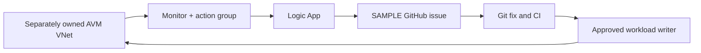

# Lab 08 · Monitor feedback — full guide

[Review index](README.md) · [Canonical guide](../docs/monitor-feedback-hands-on.md)

Complete copy below; only outside-fence relative links are rebased. No new verification or Exercise progress is claimed.

<!-- FULL-WS-LESSON:START -->
# Monitor → Logic Apps → GitHub: hands-on feedback

[First-time setup](../docs/start-here.md) · [Git help](../docs/git-workflow.md) · [Repository](../README.md)

**Goal:** use the [monitoring companion](../monitoring/README.md) for
[Microsoft DevSecOps IaC](https://learn.microsoft.com/en-us/azure/architecture/solution-ideas/articles/devsecops-infrastructure-as-code)
feedback: published Terraform AVMs for connection/workflow, native AzureRM for
Monitor. No invented Monitor AVM, Bicep or Sentinel. Finish [offline handover](activity-04.md) first.

> [!IMPORTANT]
> Outside the historical **33 graded activities**; scores stay unchanged.
> Earlier authoring initialization, validation and **two mock contract cases passed**,
> not live deployment, OAuth, routing or workshop completion. Nothing live ran in
> this documentation update. Instructor authorization, actual permissions and
> independent human live approvals remain. Monitoring issues are not AgentAlvine's **Exercise**.



## 1. Confirm scope and cost

Use [your Azure guide values](../docs/azure-setup.md). Confirm the existing RG,
connector-supported region, private GitHub owner/repository, actual
create/read/delete/test permissions, consent policy, costs and cleanup owners
with the instructor. Reading the RG is not write permission. No role grants,
provider registration, purchases or Defender changes to bypass blockers.

An instructor-provided disposable AVM VNet suffices; no earlier lab is required.
Its **separate workload root/state and approved writer** retain ownership.

## 2. Review and deliver the real file model

| File | What it supplies |
| --- | --- |
| [main.tf](../monitoring/main.tf) | Published [connection AVM 0.1.0](https://registry.terraform.io/modules/Azure/avm-res-web-connection/azurerm/0.1.0) and [workflow AVM 0.1.2](https://registry.terraform.io/modules/Azure/avm-res-logic-workflow/azurerm/0.1.2); native `azurerm_monitor_action_group` and `azurerm_monitor_activity_log_alert`; read callback action |
| [terraform.tf](../monitoring/terraform.tf) | Terraform **1.16.1**, AzureRM **4.81.0**, AzAPI **2.12.0**, ModTM **0.3.5**, Random **3.9.1** |
| [variables.tf](../monitoring/variables.tf) | Your scope, region, name, GitHub destination and exact VNet ID |
| [workflow.json](../monitoring/workflow.json) | HTTPS Request/Common Alert shape, static SAMPLE issue and secure-data settings |
| [tests/contract.tftest.hcl](../monitoring/tests/contract.tftest.hcl) | Authoring-only mock plans: one scope/no raw issue payload, and wrong-RG VNet rejection |

Follow the [profile README](../monitoring/README.md) for offline commands and private
input mapping. Choose a unique `ws2-monitor-` name with a 2–26-character lowercase
alphanumeric/hyphen suffix, first alphanumeric; Terraform appends `-github`,
`-logic`, `-ag` and `-alert`. Use your actual VNet ID in the selected subscription/RG.

Keep this profile/lock/state separate from baseline **AzureRM 5.4.0**. No live
backend or baseline Lab 07 workflow connection is configured here. Before live
work, the instructor designates the **approved Terraform root/state**, protected
writer and encrypted/locked backend. Use a fresh independently reviewed saved plan,
then apply that exact plan. Expect only the connection, workflow, action group
and alert—not RG/VNet/identity creation. Scope validation is not permission proof.

## 3. Authorize the created connection; inspect the workflow

1. Terraform creates the API connection with empty `parameter_values`, **without
   a token**. Before testing, **you, the participant connection owner**, open
   **Portal → API connections → your existing created connection → Edit API
   connection → Authorize**. Consent with your own authorized GitHub account in
   the trusted browser UI and save. Confirm access to your private repository.
   Do not create a second connection or send tokens to Terraform/chat.
2. Open the created Logic App designer/code view for **read-only inspection**.
   The `manual` Request trigger uses HTTPS `POST`, requiring `schemaId` and `data`:
   Common Alert structure, not sender authentication. `Create_issue` uses your
   owner/repository with fixed title `Sample WS2 monitoring alert` and body:
   “SAMPLE routing exercise. Review the Logic App run and Azure Monitor event
   privately. This is not a confirmed security incident; no raw resource
   identifiers or alert payload were copied.” No dynamic raw payload enters the issue.

Trigger and action both declare `runtimeConfiguration.secureData` for **inputs
and outputs**. Inspect protection without exposing secured content; stop on
authorization/policy/protection failure. Edit [workflow.json](../monitoring/workflow.json)
in Git and deliver through reviewed Terraform, **not designer edits**. Owner
authorization is required consent, not parallel Portal resource ownership.

**State contains a sensitive URL:** `data.azapi_resource_action.callback` reads
`listCallbackUrl` using `POST`. The receiver's callback is marked sensitive and
has **no output**, but remains in state and may be in plans. Redaction is not
encryption: require approved encrypted/locked restricted state and encrypted plans.
Never commit/export/print state, plans, callback URLs, tokens or connection objects;
never paste callbacks into Portal/GitHub or capture them in screenshots.

## 4. Test the saved action group's SAMPLE route

After owner authorization and test approval, open **Monitor → Alerts → Action
groups → your Terraform-created group**. Inspect its Logic App receiver and
enabled **Common Alert Schema**. Choose **Test → select an Activity Log sample
and the Logic App action → Test**; do not create another group/receiver.

**Expected:** successful test, Logic App run and actual issue in your private
repository. This is real **SAMPLE routing**, not alert detection. On failure,
inspect receiver/destination/authorization privately; correct IaC in Git. Required
unsupported connector/auth policy means stop, not weaker security.

## 5. Observe a real VNet write separately

Inspect the **existing Terraform-created alert**: exact `workload_resource_id`,
**Administrative**, `Microsoft.Network/virtualNetworks/write`, **Succeeded**,
and the created action group. Do not manually create an alert rule.

Request an approved **benign VNet tag-only change** through its separate workload
root/state and protected writer, with a reviewed plan. No public exposure or
Portal mutation. Confirm the matching new Activity Log event **and** alert, then
run/issue delivery. A no-change plan or unrelated tag operation is insufficient.
Missing/late results remain pending; an unattempted write is **not executed**.
The same static SAMPLE issue content handles this controlled event; correlate
timestamps privately, not raw payloads. It is not a confirmed incident.

## 6. Make the Git fix

For either SAMPLE path, improve [runbook.md](../runbook.md) with sample-versus-event
triage, not an invented outage. Follow [Git steps](../docs/git-workflow.md): branch
`lab/monitor-feedback`, inspect/stage sanitized edits, commit/push and link the
monitoring issue in your PR. Keep IaC in its respective approved roots.

In the completed private Lab 08 clone:

```powershell
node scripts/check-learner.mjs
```

**Why:** `node` runs the [backend-disabled learner helper](../scripts/check-learner.mjs);
expect **46 + 1** executed cases and overall success for the original exercise,
separate from the monitoring companion's two contracts. All mock results here are
configuration/authoring evidence, **not workshop completion or live proof**. Require
**Lab checks → Test learner module** green at the newest pushed SHA. Merge only
under repository rules; GitHub cannot approve your own PR. Required nonauthor
reviews and independent live approvals remain. Link sanitized PR/current CI on
the issue; never execute alert payloads or auto-merge.

## 7. Record and clean up through the owning roots

Keep actual test/run/issue/PR/current-CI results and **separate real-event status**
privately. Redact identifiers/emails/payloads before sharing. No manual checkbox
or evidence-PR protocol; expected results are not observations.

Coordinate an end to test writes and inspect active runs. If ownership/runs/writers
are unclear, stop. Use a **fresh full saved destroy plan for the monitoring root**,
independent review and protected apply of that exact plan in the same state. It
removes **only the owned connection, workflow, action group and alert** from Azure.
Verify absence and managed-state cleanup privately; no normal Portal deletion or
disablement of Terraform-owned resources, or state removal to imitate cleanup.

The VNet is **not** owned/destroyed here. Its owner must perform a **separate full
reviewed destroy through the original workload root/state and approved writer**,
then verify inventory. Neither root is automatically wired to baseline Lab 07.
Follow the [cleanup/privacy boundary](../docs/azure-setup.md#7-cleanup-privacy-and-returning-to-the-exercise):
no targets, RG/backend/shared-resource deletion or state deletion. Retain identities,
runners, existing Defender settings and sanitized issue evidence. Close SAMPLE
issues only after confirmed cleanup; uncertainty stays open with the owner.

**Official references:** [Action groups and testing](https://learn.microsoft.com/en-us/azure/azure-monitor/alerts/action-groups) · [GitHub connector](https://learn.microsoft.com/en-us/connectors/github/).

<!-- FULL-WS-LESSON:END -->
