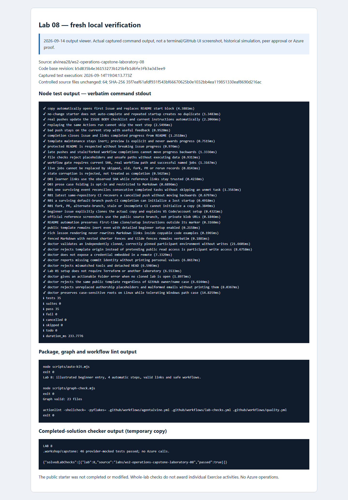

# Lab 08 · Original simulation evidence and new review captures

[Review index](README.md) · [Complete setup](00-start-here.md) · [Repository landing](../README.md)

## Dates and evidence scope

- **Original Cycle A: 2026-09-08. Original Cycle B: 2026-09-08.** These were separate fresh private learner copies, not the public source preview.
- **New review/capture date: 2026-09-14.** Fresh local checks passed and the review images were captured; neither is a third participant cycle. Results and PNG provenance are recorded separately below.
- A read-only GitHub observation rechecked the original private completion arrays and immutable CI bindings without changing progress. It separately confirmed the successful public source **Exercise #1** instructor Preview at **step 0, with 0/4 participant progress**. The source preview is not either learner's completed issue.
- Primary proof: [private Lab 08 review and original record links](https://github.com/alvine-aurelio-org/ws2-public-rebuild-20260908-evidence/blob/dev/full-ws-content/lab-08/README.md). The [original public summary](../docs/daily%20work%20report/2026-09-08.md) records the published per-lab totals. Raw private simulation logs stay private.

## Per-activity original outcomes

| Activity | Cycle A | Cycle B | What the status establishes |
| --- | --- | --- | --- |
| [01 · Sanitized incident diagnosis](activity-01.md) | Verified offline | Verified offline | Accepted structured exact-subject diagnosis of a fictional fixture, not live federation repair. |
| [02 · Safe recovery decision](activity-02.md) | Verified offline | Verified offline | Accepted runbook with active-writer protection and reviewed-correction boundary, not an executed live repair. |
| [03 · Additive app compatibility](activity-03.md) | Verified offline | Verified offline | Compatible prefix output and active caller example; original output contract and stable keys preserved. |
| [04 · Compatibility CI and handover](activity-04.md) | Verified offline | Verified offline | Current learner CI and honest handover completed the independent offline course. |

**Both original private guides completed all four offline activities: A 4/4; B 4/4.** A reviewed release, an earlier repository, or live Lab 07 work was **not required** to complete Lab 08.

Optional later genuine reviewed `v1.1.0` release, exact consumer pin, instructor-designated private Lab 07 writer, fresh approved `deploy`, separate `followup`, reviewed `destroy`, and retained-resource inventory remained **pending**. They are not silently marked complete by the offline handover or added as prerequisites for these four completed activities.

## Original test accounting — whole lab, not per activity

| Original cycle | Lab 08 progress | Node passes | Mocked case + fixture passes |
| --- | --- | --- | --- |
| A · 2026-09-08 | 4/4 | 32 | 47 |
| B · 2026-09-08 | 4/4 | 35 | 47 |

These totals belong to each **whole-lab cycle**, not each activity or push. The full checker includes the staged compatibility suite and separate actual-example validation; a first success line alone is not full completion. The canonical lesson's **46 + 1** expected execution breakdown is retained as instruction, not a new test result.

Across **all eight labs**, each original cycle reached **25/33 activities** with **five complete laboratories**. Cycle A recorded **301 Node** passes; Cycle B recorded **325 Node** passes. Each recorded **229 mocked case/fixture passes, excluding repeats**. These historical totals are not fresh 2026-09-14 results.

## Legitimate rejection coverage and limits

The [current course configuration](../.github/agentalvine/course.json) and canonical lessons ground the following required rejection boundaries. They are **not a claim that every negative case was newly executed or manually attempted in each original learner copy**. Original executed evidence remains in the private review.

| Boundary | Rejected or insufficient evidence | Grounding |
| --- | --- | --- |
| Structured diagnosis | Invalid JSON, missing/empty fields, or values other than `subject-mismatch` and `match-exact-subject` | [Activity 01](activity-01.md); exact JSON equality is not case-insensitive prose matching |
| Recovery note | Missing exact safety phrases or unfinished `TODO`; a note cannot establish five real repairs | [Activity 02](activity-02.md); five-category teaching requirement is broader than the two-phrase file gate |
| Additive contract | Missing original outputs or actual resource-derived prefix expression, unfinished text, removed stable `web`/`data`, or inactive/incorrect `app` example | [Activity 03](activity-03.md) and manifest file checks; full compatibility CI is still necessary |
| Full-helper execution | Direct-module-only testing, omitted separate actual-example case, hardcoded answers hiding old-caller failures, or zero/skipped/failed/errored checks | Activity 03's complete-checker and compatibility requirements |
| Final handover | Missing any of the eight required terms, `TODO`, stale workflow SHA, or missing/failed/skipped **Test learner module** | [Activity 04](activity-04.md); only this Markdown note's required prose matching is case-insensitive |
| Scope honesty | Treating synthetic CIDRs as live assignments, naming a template as an authorized writer, or claiming release/cloud work from offline tests | Activities 03–04; no second state writer or fabricated human approval |

The runbook's safety rules and handover's honest future tense remain essential even where automated text checks are narrower. No validation or live-delivery control was relaxed for this review pack.

## Fresh 2026-09-14 verified results

Source-quality checks and the real completed-solution fixture checker passed, with the solution exercised in an isolated **temporary copy**. The pinned workshop toolchain was Terraform **1.16.1**, AzureRM **5.4.0**, and terraform-docs **0.24.0** for documentation checks. No Azure operations occurred.

| Check | Result |
| --- | --- |
| Node tests | 35 passed; 0 failed; 0 skipped |
| auto-kit | Passed |
| graph | Passed |
| actionlint | Passed |
| Completed-solution checker | Passed — isolated temporary copy |

These are fresh whole-lab checks, not per-activity proof or new mock totals. The [fresh command record (organization access required)](https://github.com/alvine-aurelio-org/ws2-public-rebuild-20260908-evidence/blob/dev/evidence/review-2026-09-14/local/lab-08.json) is separate from the original A/B records; their progress and counts are unchanged. A completed fixture does not establish a reviewed release or optional live follow-up.

## Screenshots: distinguish observation from reconstruction

Original step-by-step browser screenshots **were not taken on 2026-09-08**. Private activity images were captured on **2026-09-14** from a labelled local viewer of preserved original records, **not original-day GitHub UI**. The [source preview image](README.md#live-public-source-preview--read-only-not-learner-progress) is a separate actual public GitHub capture of read-only Exercise #1 at step 0 (0/4), not either completed private Exercise.

*Captured on 2026-09-14 from a labelled local output viewer of the actual fresh commands, including the completed-solution fixture check in a temporary copy. This is not terminal UI, historical GitHub UI, a third participant cycle, or human/live approval. [images/provenance.json](images/provenance.json) records both public PNG SHA-256 digests and exact capture timestamps.*

Screenshots are secondary to original immutable records and actual Actions runs in the [private review](https://github.com/alvine-aurelio-org/ws2-public-rebuild-20260908-evidence/blob/dev/full-ws-content/lab-08/README.md). Publisher reference screenshots keep their original attribution and do not depict participant completion.

## Remaining work and non-claims

- Both original offline cycles completed. Optional future release and live follow-up remain pending, **not blockers to Lab 08 offline completion**.
- Any future cloud cycle belongs in one instructor-designated private Lab 07 writer with its original protections, not in this Lab 08 copy.
- No GUI sign-in, MFA completion, Copilot-seat assignment, independent review, actual incident repair, or cloud success is inferred from automation or screenshots.
- No Azure deployment, identity creation, state access, subscription change, or live cloud run occurred in this documentation work. Cloud health is **not tested**.
- The captured images and fresh local results do not rewrite the original A/B outcome or establish a reviewed release.
